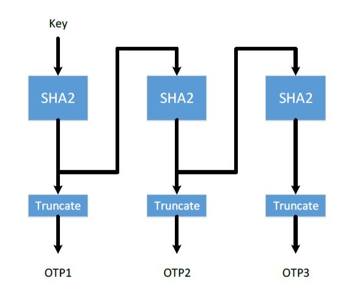

# OTP_System

## Overview

Develop an event based onetime password (OTP) system. The system consists of the following components:

1.	A soft OTP token UI which consists of a push button and a display control. Clicking on the button will generate and display the onetime password.

2.	A test UI which will prompt the user to provide the OTP, show access granted message only if the right OTP is entered.

You will need to do the following:

1.	Develop, build and test the UI components.

2.	Implement a synchronization mechanism if the two apps get out of sync.

3.	Perform Collision Resistance analysis on the OTP generation algorithm.

Use the following algorithm to generate the OTPs:

Feedback One-Time Password Algorithm (FOTP)

Hash Feedback One-Time Password Algorithm described in the following chart. Secret key is used as the initialization vector. The first OTP is generated by hashing this vector. The second OTP is generated by hashing the hash generated by the first the 1st OTP, and so on. The OTP is calculated by truncating the hash into a six-digit value.

You can set Key = 8EEE70FF00FF080F2.

Collision Resistance

This property describes the probability of generating the same OTP over a period of time. A good OTP generation algorithm should demonstrate strong collision resistance. Two metrics are calculated in N number of OTPs:

CR1: the number of matching OTPs in N.

CR2: the number of two consecutive OTPs in N (Optional +5%).

Submit the following:

1.	Complete source code and screen captures of the running program.

2.	A study of the collision property. Generate 1,000,000 OTPs using your application. Show a graph describing how the collision properties evolve as the number of OTPs increases.
